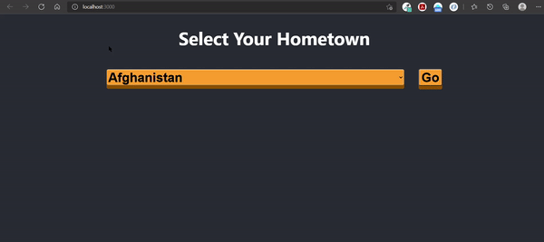
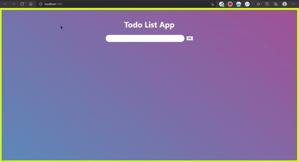
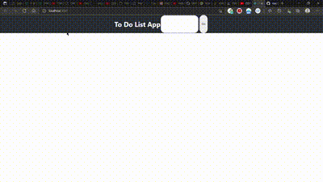

 #  THERE ARE 4 PROJECTS IN THIS REPO WHICH WERE MADE WHILE LEARNING REACT AND DOING INTERNSHIP OF HTML CSS AND JS

## **1). Web-Dev-I-4-Proj**
 
  It contains 4 projects which are designed for an internship using HTML CSS and JS.

  These are as follows:-

>A). **<u><a href="https://blog-shreyansh252001.000webhostapp.com/">Blogging Site</a></u>**
      contains a sample vlog made for the customer

>B).**<u><a href="https://css3animationsshreyansh252001.000webhostapp.com/" class="emoji bomb"> CSS3 Animation Site&nbsp; </a></u>**
      contains a site which depicts various pictures for animation

>C).**<u><a href="https://shreyansh252001movies.000webhostapp.com/">Movies Site</a></u>**(:cinema:)
      contains list of movies to choose from (only front end)
 
>D).**<u><a href="https://voterregistrationshreyansh252001.000webhostapp.com/">Voter Registration</a></u>**
      Voter Registration Page of Js , CSS and HTML.
</list>

## **2). api-intro**
    In this project there is api, useEffect hooks, asyn/await , api, tutorial with the help of npm .All this is demonstrated with the help of countries data parser in the React Js  language.

 

 

##  **3). to-do-app**
    This app is an app conatining  basic skeleton of a to-do and not much frmated lacking some  features.
 

 

## **4). todo-app-day2**
    This app contains developed version of above app but this contains more features comparedto above app which lacks some features or organised feature/ styling.This version of app works on components made as separate file inside components folder.
 
